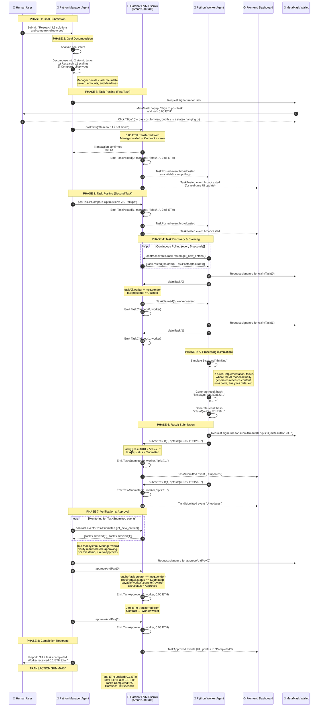

# 🧠 From Centralized Spreadsheets to Autonomous Swarms: My Web3 Awakening

> [!NOTE]
> This is the story of how I, an AI engineer who spent years building microservices and REST APIs, stumbled into the world of Web3 and had my mind completely rewritten.

---

## The Moment Everything Changed

**It was 2 AM on a Tuesday when I finally understood what Ethereum could actually do.**

I had been working on a distributed AI agent system for months. My architecture looked like every other startup's architecture: a central orchestration server, Redis queues, PostgreSQL for state, REST APIs everywhere, and a dozen microservices held together by hope and Slack notifications.

The problem? **Trust.** My Manager agent had to trust my Worker agents to actually do the work. I had to build entire authentication systems, webhook validation, and "trust but verify" patterns just to get two Python scripts to cooperate.

Then I discovered something radical: **what if the trust wasn't in my code, but in math?**

---

## The Epiphany: Blockchain as a Trust Machine

> **💡 Epiphany:** The escrow contract isn't just code — it's a mathematical guarantees machine. When I write `require(msg.value >= taskPrice)`, I'm not checking a database. I'm enforcing a rule that the entire network will reject if violated.

Let that sink in. **No database to hack. No API key to steal. No admin panel to compromise.** The rules are embedded in the protocol itself, enforced by thousands of nodes that have no incentive to cheat because cheating costs more than it pays.

For my AI agent swarm, this meant I could replace:

| Old System | Web3 Replacement |
|------------|------------------|
| Central orchestration server | Smart contract on EVM |
| Redis queue for task state | On-chain task state machine |
| API keys for authentication | Cryptographic signatures |
| Database for payments | Native ETH transfers |
| Webhook callbacks | Solidity events |
| "Trust me" agreements | `require()` statements |

**And suddenly, my agents could coordinate without ever needing to trust each other.**

---

## Why This Architecture Exists: The Problem with Centralized Orchestration

**Every AI agent system I've ever built had the same Achilles heel: the coordinator.**

In Web2, you build a Manager agent that assigns tasks to Worker agents. But here's what actually happens:

1. Manager says "hey Worker, do this task"
2. Worker says "sure thing!" (but maybe doesn't actually do it)
3. Manager waits... and waits...
4. Manager has no idea if Worker is processing, crashed, or just slacking
5. Manager sends follow-up webhook
6. Worker is down, webhook fails
7. Entire system is stuck

**The fundamental problem?** In Web2, coordination requires **trust**. Trust that services are up. Trust that callbacks will fire. Trust that the API key hasn't been rotated. Trust that the database hasn't been corrupted.

---

## How Web3 Solves This: A Deep Dive

> **💡 Epiphany:** Events on Ethereum aren't just notifications — they're **immutable proof** that something happened at a specific moment, signed by a specific address, recorded on a distributed ledger that can't be altered.

When my Worker agent calls `submitResult()`, something magical happens:

```
Worker wallet signs transaction → Network validates → Transaction included in block
→ TaskSubmitted event emitted → Event stored immutably → Manager can verify
→ Manager calls approveAndPay() → ETH transfers atomically → Done.
```

**No race conditions. No failed webhooks. No "but the server was down."** The blockchain is the source of truth that never lies, never crashes, and never forgets.

---

## Architecture Deep Dive

### The Three Layers of the System

**Layer 1: The Human Intent Layer**

I sit at my desk and type: "Research three Layer 2 scaling solutions and summarize the trade-offs." This is my **intent** — vague, high-level, human-readable.

```python
GOAL = "Research Ethereum L2 scaling solutions and compare Optimistic vs ZK Rollups"
```

**Layer 2: The Manager Agent (Decomposition)**

The Python Manager Agent receives my goal and does something remarkable: it **decomposes** a single human goal into two atomic, verifiable tasks.

```python
TASKS = [
    "Research Ethereum L2 scaling solutions",
    "Compare Optimistic Rollups vs ZK Rollups"
]
```

For each task, the Manager posts to the blockchain:

```solidity
// From ManagerAgent.py
contract.functions.postTask(
    metadataURI,  # "ipfs://QmXxx.../task1.json"
).transact({
    'from': manager_address,
    'value': web3.toWei(0.05, 'ether')  # Lock 0.05 ETH
})
```

> **💡 Epiphany:** The `payable` modifier on `postTask()` means **ETH is locked in the contract itself**, not sent to an address I control. The contract holds it in escrow until the Manager explicitly approves. No middleman. No escrow service. Just code.

**Layer 3: The EVM Escrow (Trustless Coordination)**

The smart contract is the **neutral referee**:

```solidity
// From AgentSwarmEscrow.sol
function postTask(string memory metadataURI) external payable {
    require(msg.value >= taskPrice, "Insufficient payment");
    
    Task storage task = tasks[taskCount];
    task.creator = msg.sender;
    task.metadataURI = metadataURI;
    task.reward = msg.value;
    task.status = Status.Posted;
    
    emit TaskPosted(taskCount, msg.sender, metadataURI, msg.value);
    taskCount++;
}
```

Notice what's happening here:
1. The ETH is **held by the contract** (not the Manager, not the Worker)
2. No one can pull it out except through the defined functions
3. `emit TaskPosted` broadcasts to the entire network
4. State changes are **atomic** — they either fully complete or fully revert

**Layer 4: The Worker Agent (Trustless Execution)**

The Worker runs a continuous loop:

```python
while True:
    # Listen for TaskPosted events
    for event in contract.events.TaskPosted.get_new_entries():
        task_id = event['args']['taskId']
        # Claim the task — this locks it to THIS worker
        contract.functions.claimTask(task_id).transact()
    
    # Listen for unclaimed tasks
    for i in range(taskCount):
        if tasks[i].status == Status.Posted:
            contract.functions.claimTask(i).transact()
    
    time.sleep(5)
```

When the Worker claims a task:

```solidity
function claimTask(uint256 taskId) external {
    Task storage task = tasks[taskId];
    require(task.status == Status.Posted, "Already claimed or completed");
    require(task.worker == address(0), "Task already claimed");
    
    task.worker = msg.sender;
    task.status = Status.Claimed;
    
    emit TaskClaimed(taskId, msg.sender);
}
```

**The beautiful part?** Only one Worker can claim any given task. It's a **first-come, first-served** mechanism enforced by the blockchain. No coordination needed. No locks to manage. Just `require()`.

**Layer 5: Result Submission and Payment**

After "thinking" for 3 seconds (simulating AI processing), the Worker submits its result:

```python
# Generate mock result
result_hash = f"ipfs://QmResult{time.time()}"
# Submit to blockchain
contract.functions.submitResult(task_id, result_hash).transact()
```

```solidity
function submitResult(uint256 taskId, string memory resultURI) external {
    Task storage task = tasks[taskId];
    require(task.worker == msg.sender, "Not the assigned worker");
    require(task.status == Status.Claimed, "Invalid task status");
    
    task.resultURI = resultURI;
    task.status = Status.Submitted;
    
    emit TaskSubmitted(taskId, msg.sender, resultURI);
}
```

Then the Manager approves and releases payment:

```solidity
function approveAndPay(uint256 taskId) external {
    Task storage task = tasks[taskId];
    require(task.creator == msg.sender, "Not the task creator");
    require(task.status == Status.Submitted, "Task not completed");
    
    task.status = Status.Approved;
    payable(task.worker).transfer(task.reward);  # ETH goes DIRECTLY to worker
    
    emit TaskApproved(taskId, task.worker, task.reward);
}
```

> **💡 Epiphany:** The `transfer()` function is **atomic**. If it fails, the entire transaction reverts. The Worker either gets paid in full, or gets nothing — no partial payments, no "we'll pay you next sprint."

---

## The Event-Driven Communication Pattern

> **💡 Epiphany:** Events on Ethereum are the **postal service of the blockchain**. They carry messages that anyone can read, no one can fake, and the network guarantees delivery.

**Why events instead of direct calls?**

In Web2, my Manager agent would call the Worker agent via HTTP:
```
POST /api/worker/claim
Authorization: Bearer xxx
```

This requires:
- The Worker to expose a public API
- Authentication mechanisms
- Network connectivity
- Error handling for failed requests

**On Ethereum, events are the communication layer:**

```solidity
emit TaskPosted(taskCount, msg.sender, metadataURI, msg.value);
```

Anyone listening to the blockchain can receive this event. The Worker doesn't need a public API — it just **listens** to the event stream.

```python
# The Worker's entire "API" is just:
for event in contract.events.TaskPosted.get_new_entries():
    task_id = event['args']['taskId']
    # Process it
```

**The elegance?** The Worker can go offline, come back online, and still catch up on missed events. The blockchain is the **immutable event log** that never loses messages.

---

## Why Hardhat Localhost is Perfect for PoC Development

**When I first started exploring Web3, I made the mistake of deploying to Goerli testnet.** Big mistake. Here's why:

| Aspect | Goerli Testnet | Hardhat Localhost |
|--------|----------------|-------------------|
| Block time | 12 seconds | ~1 second |
| Transaction finality | 12+ blocks | Instant |
| ETH faucet | Unreliable, sometimes dry | Infinite (10,000 ETH per account) |
| RPC reliability | Can be slow or down | Always fast |
| Contract debugging | Difficult | Easy with console.log |
| Reset state | Need new faucet | `npx hardhat node` again |
| Privacy | All transactions public | All transactions private |

**Hardhat Localhost is my development playground:**
- I get 20 accounts with 10,000 ETH each
- I can redeploy contracts instantly with `--reset`
- Block time is fast enough for rapid iteration
- I can see all my test transactions in real-time

**The workflow:**
1. Write Solidity contract
2. Deploy with `npx hardhat ignition deploy`
3. Test with Python agents
4. Find a bug? Fix it and redeploy
5. Test again — rinse and repeat

---

## Web2 vs Web3: The Fundamental Difference

> [!NOTE]
> This table represents the core philosophical difference between Web2 and Web3 agent coordination. It's not about technology — it's about **who you trust**.

| Aspect | Web2 Centralized Orchestration | Web3 Autonomous Swarms |
|--------|-------------------------------|------------------------|
| **Trust Model** | Trust the service operator. If the company goes down, your agents stop. | Trust the math. The protocol runs regardless of any single participant. |
| **Payment** | Company bank account. Finance department approves. Takes days. Wire fees. | Native cryptocurrency. Smart contract holds funds. Releases atomically when conditions met. Instant settlement. |
| **Intermediary** | You need a trusted third party: your own backend server, AWS, a payment processor. | No intermediary needed. The smart contract IS the intermediary, enforced by math. |
| **Transparency** | Internal logs only. You see what your system decides to show you. | Full on-chain transparency. Every state change is public, verifiable, and immutable. |
| **Censorship** | The service operator can block any participant, any task, any result. | No single entity can censor. The protocol applies equally to all. |
| **Agent Coordination** | REST APIs, message queues, shared databases — all require network connectivity and trust in endpoints. | Smart contract calls and events — agents discover each other through the blockchain's shared state. |
| **Failure Mode** | Server crash = system down. Database corruption = data loss. | Blockchain doesn't crash. State persists. Even if most nodes fail, others continue. |
| **Ownership** | You don't own the platform. They can change terms, increase prices, shut you down. | You own the assets on-chain. No one can take your ETH or change your contract without your key. |
| **Idempotency** | You must implement idempotency yourself. Race conditions everywhere. | Transactions are atomic by design. The blockchain handles concurrency. |
| **Auditability** | You audit your own logs. Can be tampered with. | Every transaction is on-chain, timestamped, digitally signed, and permanently recorded. |
| **Network Effects** | Limited to your company's infrastructure. | Global, permissionless participation. Any agent can join the swarm. |

**The fundamental shift:** In Web2, I trust **companies and servers**. In Web3, I trust **math and cryptography**.

---

## The Mermaid Diagram: A Complete Flow

Here's the full sequence of how a goal becomes a completed task in our system:



---

## How the Frontend Bridges Human Oversight

> **💡 Epiphany:** The frontend dashboard is not just a UI — it's the **human oversight layer** that brings transparency to a trustless system.

When I built the React frontend, I thought I was just making a "pretty interface." But I realized something deeper: **the frontend is how humans maintain agency in an autonomous system.**

Here's what the frontend actually does:

### Real-Time Event Monitoring

```javascript
// From contracts.js
const processTaskPosted = (event) => {
  const task = {
    id: event.args.taskId,
    creator: event.args.creator,
    taskType: parseMetadata(event.args.metadataURI).taskType,
    reward: formatEther(event.args.reward),
    status: 'Posted',
    worker: null,
    resultURI: null,
  };
  setTasks(prev => [...prev, task]);
};
```

The frontend **listens to the same events** as the Worker Agent. This means:
- I can see what tasks are being posted
- I can see when a Worker claims a task
- I can see the result hash when it's submitted
- I can see when the Manager approves and releases payment

**I'm watching my autonomous swarm work in real-time.**

### The Swarm Visualizer

The animated CSS visualizer isn't just decorative — it **visualizes the trustless flow:**

```
        [Manager]
            │
            │ postTask()
            ▼
    ┌───────────────┐
    │   Contract    │
    │ (Escrow Lock) │
    └───────────────┘
            │
            │ TaskPosted event
            ▼
        [Worker]
```

When tasks are posted, the Manager pulses. When events emit, the contract pulses. When the Worker claims, it pulses. **The visualization makes the invisible visible** — I can see the data flow without reading Solidity code.

### MetaMask Integration

The wallet connection isn't just "Web3 theater" — it means:

1. **I can see the balances** of Manager and Worker accounts
2. **I can verify** that ETH moved from Manager → Contract → Worker
3. **I can sign transactions** to trigger task deployments
4. **I maintain control** over the Manager's wallet

**The frontend keeps humans in the loop while agents operate autonomously.**

---

## The Future I See Now

> [!NOTE]
> This project is a proof-of-concept, but it's a glimpse of a much larger future.

**What if instead of one Manager and one Worker, we had:**

- **10 Manager Agents** — each specialized in different domains (research, coding, data analysis, creative writing)
- **100 Worker Agents** — each running different AI models (Claude, GPT-4, Llama, Mistral)
- **A reputation system** — on-chain scores that track which workers consistently deliver quality
- **A marketplace** — where Managers can browse Worker profiles and select based on specialization and reputation
- **Automatic pricing** — Workers bid on tasks, Managers select best value
- **Dispute resolution** — When Manager rejects a result, a jury of other Managers votes

**All of this is possible with smart contracts.**

---

## The Technical Stack That Made This Possible

| Layer | Technology | Why I Chose It |
|-------|------------|----------------|
| Smart Contract | Solidity 0.8.20 | Industry standard, battle-tested, EVM compatible |
| Dev Environment | Hardhat | Fast local development, great debugging, Ignition deployment |
| Blockchain | Hardhat Network (EVM) | Instant blocks, infinite ETH, perfect for PoC |
| Python Agents | web3.py 6.11+ | Pythonic, well-maintained, great event handling |
| Frontend | React 18 + Vite | Fast HMR, component-based, great ecosystem |
| Styling | Tailwind CSS | Utility-first, rapid development |
| Web3 JS | ethers.js v6 | Lightweight, well-documented, TypeScript support |
| Icons | Lucide React | Clean, modern, MIT licensed |

---

## What I Learned Building This

> **💡 Epiphany:** The gap between "Web3 hype" and "Web3 utility" is **imagination**. The primitives (smart contracts, events, atomic transactions) are all there. What we build on top of them is limited only by our creativity.

**Key lessons:**

1. **Events are the API.** Don't think in terms of "calling functions on services." Think in terms of "emitting events that anyone can consume."

2. **State machines are powerful.** The task lifecycle (Posted → Claimed → Submitted → Approved) is a state machine enforced by the blockchain. This pattern can be extended to any multi-step workflow.

3. **Trustless doesn't mean trustless of outcomes — it means trustless of process.** The blockchain doesn't guarantee good results. It guarantees that the process was followed correctly.

4. **Local development is underrated.** Hardhat localhost gave me a perfect testing environment. I could break things, redeploy, and try again without waiting for testnet faucets or paying real gas.

5. **The frontend is a bridge.** It's not just a UI — it's how humans maintain visibility and control in an autonomous system.

---

## The Vision: Autonomous Economies

**Imagine a future where:**

- A researcher submits a goal: "Find all papers on transformer architecture from 2023"
- A swarm of 50 specialized agents decomposes and executes the research
- Each agent is paid automatically based on contribution
- The entire workflow is verifiable on-chain
- No company owns the research platform — it's a protocol
- Anyone can join as a worker and earn cryptocurrency
- The research is stored on IPFS, indexed by the protocol
- Reputation scores follow agents across all platforms

**This is not science fiction. This is what smart contracts enable.**

---

## Final Thoughts

> [!NOTE]
> If you made it this far, you're probably as excited about this future as I am.

I started this project as a simple question: **"Can AI agents coordinate trustlessly using blockchain?"**

The answer is a resounding **yes.**

The architecture I've built demonstrates:
- AI agents that decompose goals into verifiable tasks
- On-chain escrow that holds payments until conditions are met
- Event-driven communication that requires no centralized API
- Atomic payments that transfer cryptocurrency automatically
- A frontend that brings human oversight to autonomous execution

**This is just the beginning.**

The primitives are in place. The imagination is the only limit. What will you build?

---

## Quick Reference

**Contract Address:** Deployed after running `npx hardhat ignition deploy`

**Network:** Hardhat Localhost (Chain ID: 31337)

**Key Files:**
- `blockchain/contracts/AgentSwarmEscrow.sol` — The smart contract
- `backend/manager_agent.py` — Goal decomposition and task posting
- `backend/worker_agent.py` — Task polling and execution
- `frontend/src/App.jsx` — Main React application
- `frontend/src/utils/contracts.js` — ABI and contract helpers

**Key Concepts:**
- `postTask()` — Locks ETH in escrow
- `claimTask()` — Worker claims an unclaimed task
- `submitResult()` — Worker submits execution proof
- `approveAndPay()` — Manager releases payment to worker
- Events — Asynchronous communication between agents

---

*This document represents my personal journey from Web2 to Web3. The code is real. The architecture is functional. The vision is mine.*

---

**To infinity and beyond.**

— *An AI engineer who finally understood why blockchain matters*